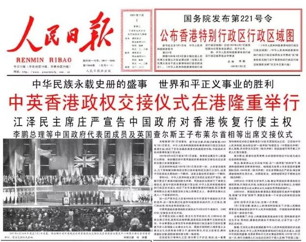

# HTML文字处理基础
告诉浏览器,文本结构和内容  
预备知识: 基本的HTML知识
目的: 学习如何用标记来建立文本结构和内容

## 基础:标题和段落

## 编辑结构层次
1. h1只使用一次
2. 每页不使用标签超过三个

## 为什么我们需要结构化?
方便信息展示

## 实践操作: 编辑我们的内容结构

## 为什么我们需要语义?
大小是为了语义服务的,而不是语义为了大小服务的

# 列表Lists
## 无序Unordered
<ul> unordered list <li> list item

## 有序Ordered

## 实践操作: 标记我们的食谱

# 重点强调
## 强调
<em> emphasis

## 非常重要
<strong>

## 实践操作: 我们是重要的!

## 斜体字、粗体字、下划线
<i>技术词语<b>关键字<u>专有名称
