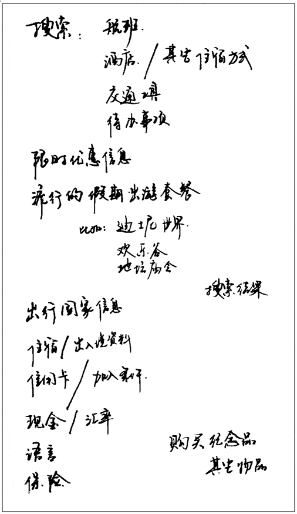
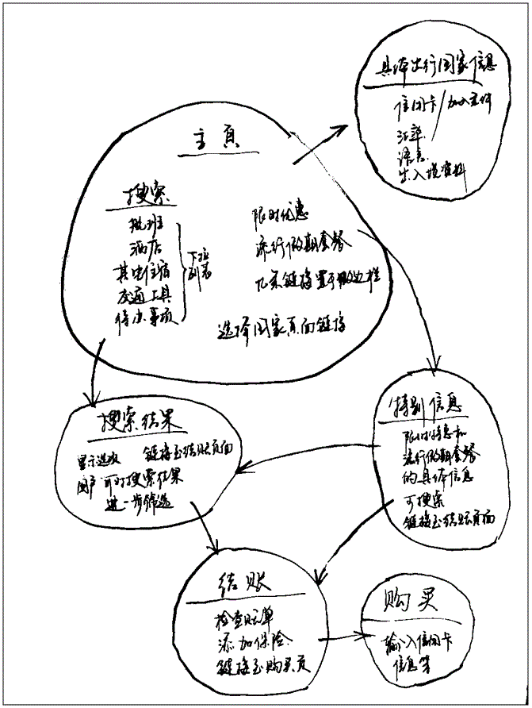

# 文档与网站架构
内容: 如何规划网站结构,根据规划的结构编写HTML  
预备:  
目标: 使用语义标签来构建文档,搭建简单的网站结构

## 文档的基本组成部分
页面的结构基本上是固定的

### 页眉
大标题或一个标志  
存在于所有网页

### 导航览
菜单按钮,链接或标签页  
通常在所有网页之间保持一致

### 主内容
当前网页大多数的独有内容,例如视频、文章

### 侧边栏
广告,链接,通常与网页无关

### 页脚
和标题一样,页脚是防止公共信息(版权声明或联系方式)

## 用于构建内容的HTML
可以通过CSS做成想要的样子,但是更要敬畏语义,正确地选用元素  

使用合适的标签:
1. header: 页眉
2. nav: 导航栏
3. main: 主内容 子内容: article,section和div
4. aside: 侧边栏
5. footer: 页脚

### 主动学习: 研究示例代码
页眉 header
导航栏 nav
主内容 main 副内容 section
侧边栏 aside
页脚 footer

# HTML布局元素细节
1. main 只能用一次,不要被嵌套
2. article 文章
3. section 章节, 搭配标题title使用
4. aside 广告
5. header 页眉,有可能是全局的,也可能是独有的
6. nav 主导航功能,不应包括二级链接
7. footer 页面的页脚部分

## 无语义元素
span: 行内元素  
div: 一多行元素  

## 换行与水平分割线
br hr

# 规划一个简单的网站
按照步骤就可以规划出好的网站.  
需要考虑 要哪些页面,如何排列组合这些页面,如何互相链接, 又称信息架构

1. 时刻记住,大多数页面共用元素: 导航菜单以及页脚内容.

2. 为页面结构绘制草图,记录每一块作用

3. 期望添加进站点的所有其它内容展开头脑风暴,直接罗列出来

4. 对内容进行分组,哪些内容放同一个页面

5. 绘制站点地图的草图,气泡代表网站的页面,绘制连线表示一般的工作流,主页面位于中心

## 主动学习: 创建站点地图