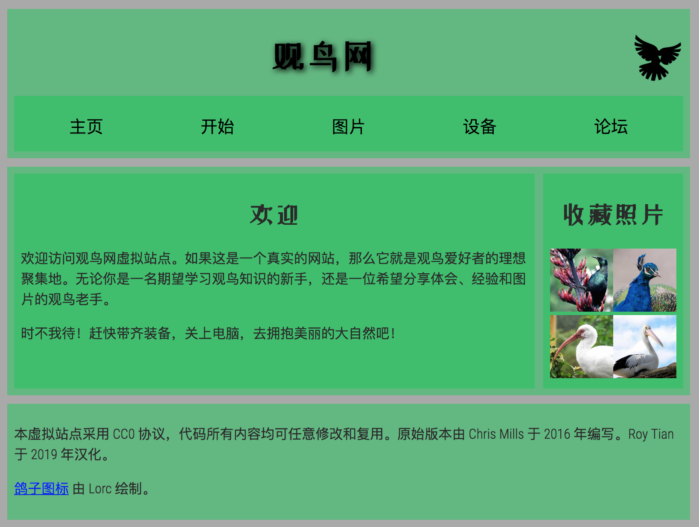

# 构建内容丰富的网页
页面构建清晰才能交付进行CSS布局  
target: 测验网页结构知识和用标记呈现预期布局设计

## 起点
1. HTML
2. CSS
3. 图片

## 项目简介
给"观鸟网"添加结构化元素,进行布局.需要添加:
1. 页眉(<header>): 页宽满,含主标题,logo和导航栏菜单.预期: 标题和logo显示两边,导航栏在下方
2. 主内容区域(<main>): 主区域显示欢迎,侧边aside包含一些缩略图
3. 页脚(<footer>), 包含版权信息和鸣谢

标签:
1. 页眉
2. 导航菜单
3. 主要内容
4. 欢迎语
5. 图片侧边栏
6. 页脚

引入CSS

## 提示

## 示例

## 总结
Html css要在js前面
