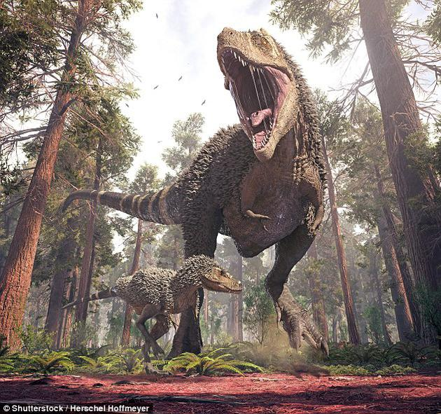

# HTML中的图片
学习 <figure>  
目标: 插入简单的图片,加说明.CSS背景图片与HTML图片.

## 怎样将一幅图片放到网页上?
注意不要用别人的图片,这个叫盗链
```html
<!--src=source-->


```

### 备选文本
```html

```
在图片错误的情况下显示

### 宽度和高度
```html

```

### Image titles 图片标题
```html

```

### 动手练习:嵌入一张图片

## 通过为图片搭配说明文字的方式来解说图片
```html
<figure>

 <figcaption>曼彻斯特大学博物馆展出的一只霸王龙的化石</figcaption>
</figure>
```
使用figure容器, figcaption为图片建立清晰的关联

### 动手练习:创建一个figure

## CSS背景图片
用CSS把图片嵌入网站中, CSS只是装饰,没有任何意义
```stylus
p {
  background-image: url("01/dinosaur.jpg");
}
```

## 总结  
图片和说明文字.

